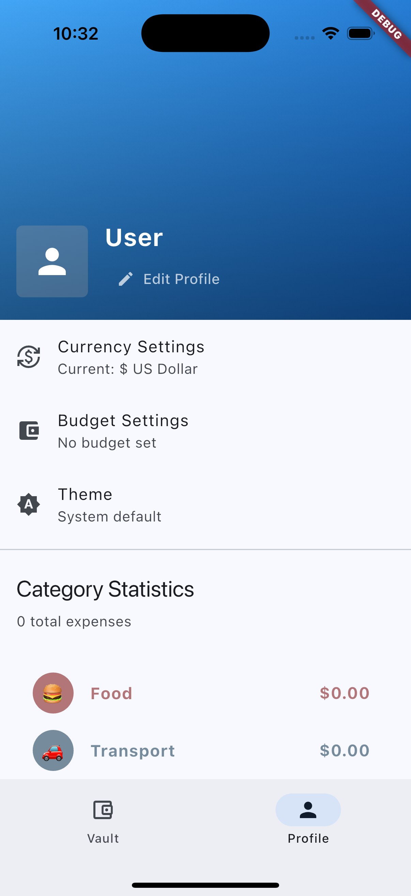

# NewLedger

NewLedger is a modern expense tracking and financial management application built with Flutter. It helps users manage their personal and shared expenses with features like expense splitting, receipt scanning, and detailed financial analytics.

## Features

### Core Functionality
- 💰 Track personal and shared expenses
- 👥 Split expenses with friends and family
- 📊 Detailed expense analytics and reporting
- 📷 Receipt scanning and storage
- 📱 Cross-platform support (iOS, Android)

### User Experience
- 🌙 Dark/Light theme support
- 🎨 Modern, intuitive interface
- 📊 Visual expense breakdowns
- 🔍 Advanced expense filtering
- 💱 Multi-currency support

### Technical Features
- 📱 Built with Flutter
- 💾 Local data persistence with Hive
- 📸 Camera integration for receipts
- 🔒 Secure data storage
- 🔄 State management with Provider

## Screenshots

<p float="left">
  
   
  
  
  
  
  
  
  
</p>

## Installation

1. Ensure you have Flutter installed on your machine. For installation instructions, visit [Flutter's official documentation](https://flutter.dev/docs/get-started/install).

2. Clone the repository:
```git clone https://github.com/YangLin14/NewLedger2.git```

3. Navigate to project directory and install dependencies:
```cd NewLedger2```
```flutter pub get```

4. Run the app:
```flutter run```

## Project Structure

```
lib/
├── models/                   # Data models
│   ├── expense.dart         # Expense model
│   ├── category.dart        # Category model
│   └── profile.dart         # User profile model
│
├── providers/               # State management
│   └── expense_store.dart   # Main state store
│
├── services/               # Business logic
│   └── currency_service.dart # Currency handling
│
├── utils/                  # Helper functions
│   └── constants.dart      # App constants
│
├── views/                  # UI screens
│   ├── splash_view.dart    # Launch screen
│   ├── content_view.dart   # Main container
│   ├── vault_view.dart     # Expense list
│   ├── profile_view.dart   # User profile
│   ├── add_expense_view.dart # Add expense
│   ├── split_details_view.dart # Split expenses
│   └── category_detail_view.dart # Categories
│
├── widgets/               # Reusable components
│   ├── collaborator_dialog.dart # User collaboration
│   └── profile_edit_sheet.dart # Profile editing
│
└── main.dart             # App entry point

assets/
├── images/               # Image assets
│   ├── logo.png         # App logo
│   └── NewLedger*.png   # Screenshots
│
└── fonts/               # Custom fonts

android/                 # Android specific files
├── app/
│   └── src/
│       └── main/
│           ├── kotlin/  # Kotlin source
│           └── res/     # Resources
│
ios/                    # iOS specific files
├── Runner/
│   └── Assets.xcassets/ # iOS assets
│
web/                    # Web specific files
└── index.html          # Web entry point
```

The project follows a clean architecture pattern with clear separation of concerns:
- `models/`: Data structures and business logic
- `providers/`: State management using Provider
- `services/`: Business logic and external services
- `views/`: UI screens and navigation
- `widgets/`: Reusable UI components

## Key Features Explained

### Expense Management
- Add and track expenses with detailed information
- Categorize expenses for better organization
- Attach receipts using device camera
- Add notes and additional details to expenses

### Expense Splitting
- Split expenses among multiple users
- Track individual shares and balances
- Manage group expenses efficiently
- Settlement tracking and history

### Categories and Analytics
- Custom expense categories
- Detailed spending analytics
- Visual representations of expenses
- Time-based expense tracking

## Development Setup

### Prerequisites
- Flutter SDK (latest stable version)
- Android Studio / Xcode
- iOS Simulator / Android Emulator
- Physical device (optional)

### Running in Development
```bash
# Debug mode
flutter run

# Release mode
flutter run --release
```

### Building for Production

#### Android
```bash
flutter build apk --release
```

#### iOS
```bash
flutter build ios --release
```

## System Requirements

- **iOS**: iOS 12.0 or higher
- **Android**: Android 5.0 (API level 21) or higher
- **Flutter**: Latest stable version
- **Dart**: Latest stable version

## Dependencies

Key packages used in this project:
- `provider`: For state management
- `hive`: Local database storage
- `camera`: Device camera access
- `path_provider`: File system access
- `intl`: Internationalization support

## Support

For support, email fongyu903@gmail.com.

---

Made with ❤️ by Fong-Yu (Yang) Lin